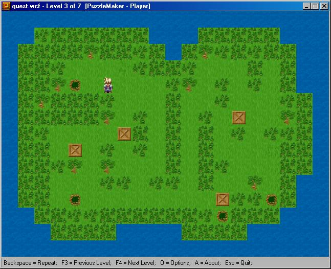



## Awesome Puzzle Game Maker, Editor, and Player

### Description

A GREAT puzzle game...very fun! Make all your own custom levels & games in the easy to use Level Editor. Then play your game in the Puzzle Player, and see your game run perfectly smooth utilizing the BitBlt API. Customize all the graphics, sound effects, music, and levels. Swap your levels with friends to see if they can beat your game. Even if you can't understand some of the coding, this is still a great program to have, and a lot of fun. Contains lots of options, and lots of customizability.
 
### More Info
 

             |
---                |---
**Submitted On**   |2000-08-23 09:02:28
**By**             |[David Peace](https://github.com/Planet-Source-Code/PSCIndex/blob/master/ByAuthor/david-peace.md)
**Level**          |Intermediate
**User Rating**    |4.8 (110 globes from 23 users)
**Compatibility**  |VB 5\.0, VB 6\.0
**Category**       |[Games](https://github.com/Planet-Source-Code/PSCIndex/blob/master/ByCategory/games__1-38.md)
**World**          |[Visual Basic](https://github.com/Planet-Source-Code/PSCIndex/blob/master/ByWorld/visual-basic.md)
**Archive File**   |[CODE\_UPLOAD92398232000\.zip](https://github.com/Planet-Source-Code/david-peace-awesome-puzzle-game-maker-editor-and-player__1-10937/archive/master.zip)

